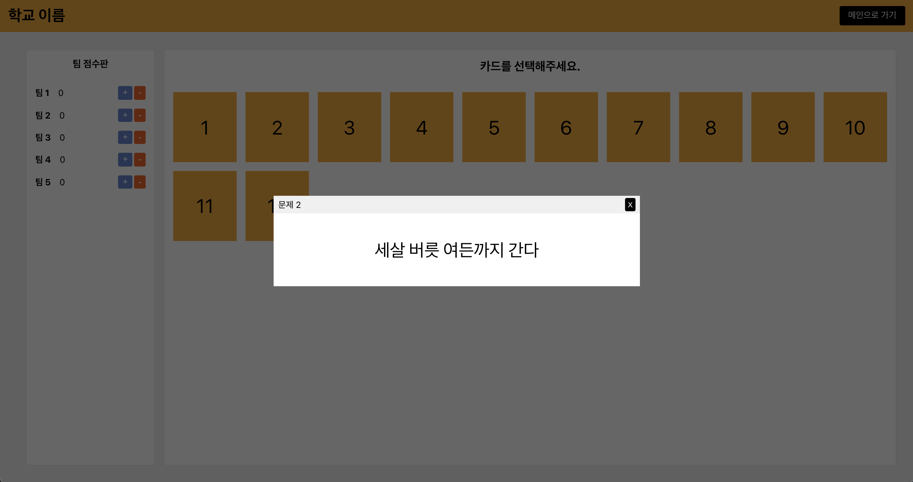

# 같은 카드 맞추기 게임

<p align="center">
  
</p>

## 목차

- [소개](#소개)
- [기술 스택](#기술-스택)
- [설치 방법](#설치-방법)
- [사용 방법](#사용-방법)
- [문제 바꾸기](#문제-바꾸기)

## 소개

- 같은 카드를 맞추는 간단한 웹 애플리케이션입니다.

## 기술 스택

- ES2015+
- React
- React-router-dom
- styled-component
- normalize.css

## 설치 방법

- [nodeJS](https://nodejs.org/ko/) 설치가 필요합니다. (LTS 버전 권장)
- 애플리케이션을 다운받은 후 해당 명령어를 실행합니다.

```shell
npm install
npm start
```

- 명령어 실행 후 `http://localhost:3000/`에서 애플리케이션 실행을 확인할 수 있습니다.

## 사용 방법

<p align="center">
  
</p>

- 메인 화면에서 팀 수를 입력한 후 시작하기 버튼을 누르면 게임이 시작됩니다.
- 제목은 src/components/Main/index.js 에서 81번째 줄을 수정하면 됩니다.
```js
<Title>
  같은 카드 맞추기 게임 (제목 적기) // 해당 부분 수정
</Title>
```
- 팀 수는 2부터 10까지 가능합니다.

<p align="center">
  
</p>

- 왼쪽 팀 점수판에서 각 팀별로 점수를 올리거나 내릴 수 있습니다.
- 오른쪽 게임 화면에서 카드를 선택합니다.
- 짝이 맞는 카드를 선택하면 해당 카드들은 자동으로 사라집니다.

<p align="center">
  
</p>

- 카드를 클릭하면 카드에 해당되는 문제를 맞출 수 있습니다.

## 문제 바꾸기

```
[문제 경로]
src/data/problems.js

[문제에 사용할 이미지 저장 경로]
src/assets
```

- 문제 파일인 `problems.js`를 열면 문제를 입력할 수 있습니다.
- 문제의 형식은 아래와 같습니다.

```json
{
  "number": 1, // 문제 번호
  "title": "문제 1", // 문제 제목
  "content": "세살 버릇 여든까지 간다", // 문제 내용
  "images": [ // 이미지 리스트
    // 객체 하나당 이미지에 대한 정보
    {
      "src": TestImage, // 이미지 경로
      "width": "400px", // 이미지 가로 사이즈
      "height": "auto", // 이미지 세로 사이즈
      "description": "속담" // 이미지 설명 텍스트
    }
  ],
  "pair": 2, // 해당 문제의 짝이 될 문제 번호
  "isCleared": false // 문제를 풀면 바뀌는 플래그.
}
```

- 이미지 추가 방법
  1. src/assets 경로에 이미지를 추가한다 (ex: test.jpg)
  2. src/data/problems.js 상단에 해당 이미지를 추가한다.
  ```js
  import TestImage from "../assets/test.jpg";
  ```
  3. `problems.js`에서 문제 객체 중 `images` 속성을 추가한 후 배열에 이미지 정보를 추가한다.
  ```json
  "images": [
    {
      "src": TestImage, // 이미지 경로
      "width": "400px", // 이미지 가로 사이즈
      "height": "200px", // 이미지 세로 사이즈
      "description": "속담" // 이미지 설명 텍스트
    }
  ]
  ```
